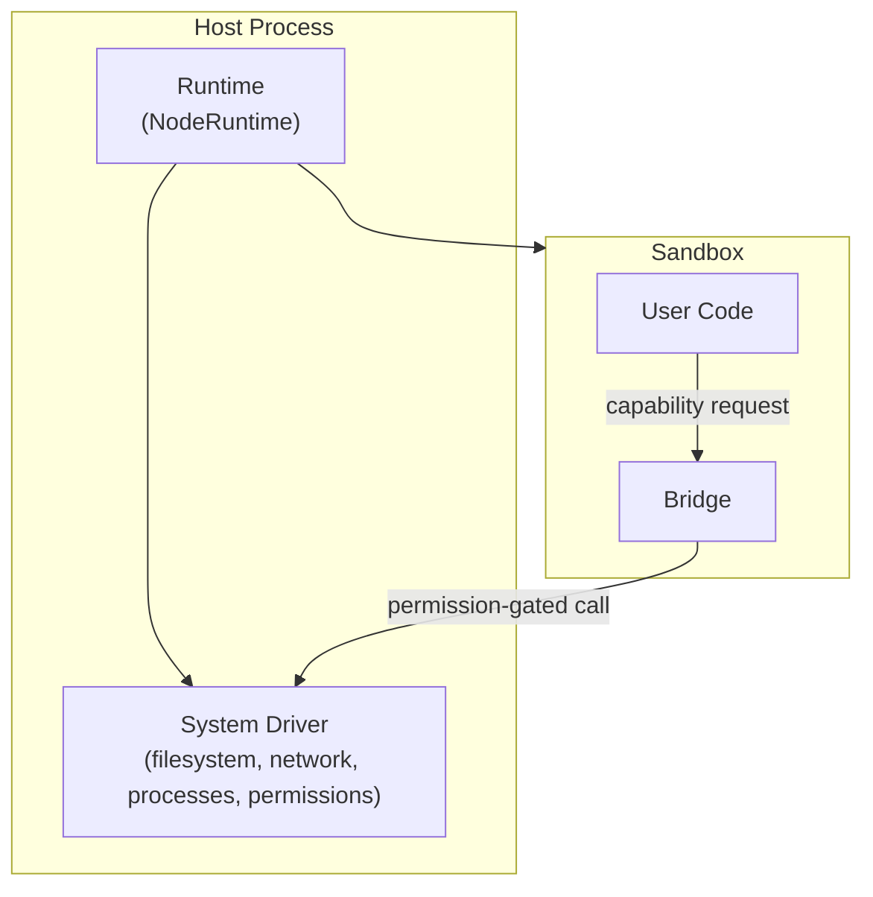
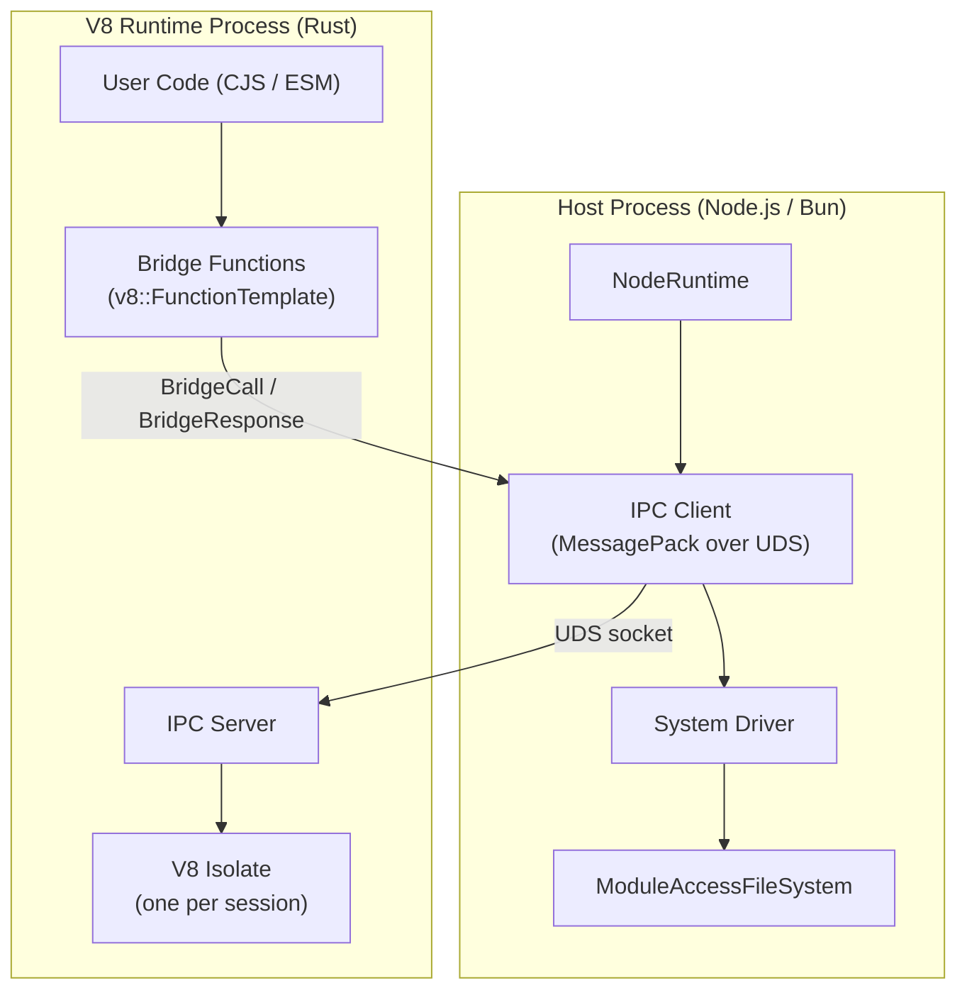
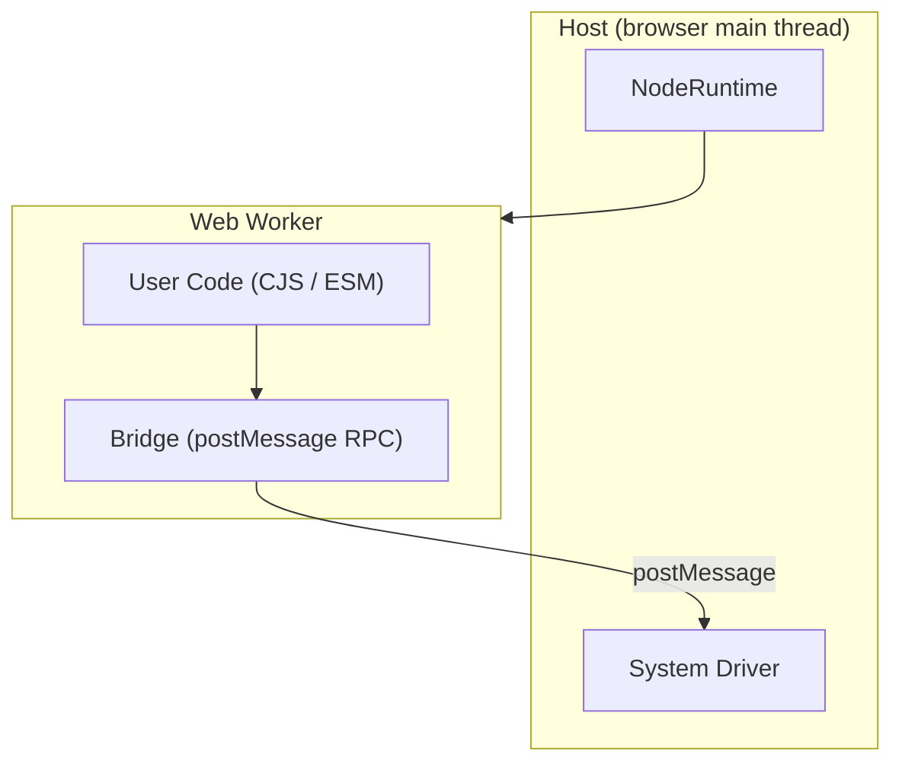

## Overview

Every secure-exec sandbox has three layers: a **runtime** (public API), a **bridge** (isolation boundary), and a **system driver** (host capabilities).



User code runs inside the sandbox and can only reach host capabilities through the bridge. The bridge enforces payload size limits on every transfer. The system driver wraps each capability in a permission check before executing it on the host.

## Components

### Runtime

The public API. `NodeRuntime` is a thin facade that accepts a system driver, then delegates all execution to the isolate.

```ts
import { NodeRuntime, createNodeDriver } from "secure-exec";

const runtime = new NodeRuntime({
  systemDriver: createNodeDriver(),
});

await runtime.exec("console.log('hello')");
await runtime.run("export default 42");
runtime.dispose();
```

### System Driver

A config object that bundles host capabilities. Deny-by-default.

| Capability | What it provides |
|---|---|
| `filesystem` | Read/write/stat/mkdir operations |
| `network` | fetch, DNS, HTTP |
| `commandExecutor` | Child process spawning |
| `permissions` | Per-capability allow/deny checks |

Each capability is wrapped in a permission layer before the bridge can call it. Missing capabilities get deny-all stubs.

### Bridge

The narrow interface between the sandbox and the host. All privileged operations pass through the bridge. It serializes requests, enforces payload size limits, and routes calls to the appropriate system driver capability.

## Node Runtime

On Node, the sandbox is a V8 isolate running in a **separate Rust process** (`@secure-exec/v8`). The host communicates with it over a Unix domain socket using length-prefixed MessagePack.



### Why a separate process

V8 has process-global state (`V8::Initialize`, signal handlers, ICU data) that makes running two V8 instances in one process unsafe. The separate process also provides defense-in-depth: V8 OOM kills the child not the host, FD tables are isolated, and the OS can enforce cgroups/seccomp on the sandbox process.

### IPC protocol

All host↔sandbox communication uses **length-prefixed MessagePack** over a Unix domain socket:

```
[4-byte u32 big-endian length][N-byte MessagePack payload]
```

Message types are internally tagged (`{"type": "BridgeCall", ...}`). Binary data fields use MessagePack's native `bin` format — no base64 encoding.

### Serialization layers

There are two MessagePack serialization layers:

1. **IPC envelope** — the outer message (`BridgeCall`, `BridgeResponse`, `ExecutionResult`, etc.) serialized with `rmp_serde` (Rust) / `@msgpack/msgpack` (JS).
2. **Bridge arguments/results** — function arguments and return values are separately MessagePack-encoded as opaque byte blobs (`args`, `result` fields) inside the IPC envelope. On the Rust side, V8 values are converted to/from `rmpv::Value` via native V8 API calls (`v8_to_rmpv` / `rmpv_to_v8`). On the JS host side, `@msgpack/msgpack` `encode()`/`decode()` handles the inner payloads.

This double-encoding means the IPC framing layer doesn't need to understand bridge argument types — it just forwards opaque bytes.

### Bridge calling conventions

When sandbox code calls a bridge function (e.g. `fs.readFileSync()`):

1. **Sync-blocking**: The V8 `FunctionTemplate` callback serializes args as MessagePack, sends a `BridgeCall` over IPC, and **blocks on `socket.read()`** for the `BridgeResponse`. The JS host processes the call asynchronously, sends the response back. From V8's perspective, the function is synchronous.
2. **Async (promise-returning)**: The callback creates a `v8::PromiseResolver`, sends `BridgeCall` non-blocking, and returns the promise. When the `BridgeResponse` arrives during the session event loop, the resolver is fulfilled/rejected and microtasks are flushed.
3. **Streaming (host→sandbox)**: The host sends `StreamEvent` messages for child process stdout/stderr/exit and HTTP server requests. The Rust event loop dispatches these into V8 callback functions.

### What uses native V8 types (no serialization)

- `_processConfig` and `_osConfig` are injected as frozen V8 objects directly by Rust
- Bridge functions are registered via `v8::FunctionTemplate` (local V8 calls, not IPC)
- Context hardening (SharedArrayBuffer removal, WASM disabling) uses direct V8 API calls
- Module compilation, error extraction, and timeout termination are all native V8 operations

**Inside the isolate:**
- User code runs as CJS or ESM (auto-detected from `package.json` `type` field)
- Bridge globals are registered as V8 `FunctionTemplate` callbacks for fs, network, child_process, crypto, and timers
- ESM modules are loaded via `v8::Module` with a sync-blocking `ResolveModuleCallback` (IPC round-trip per import)
- Compiled modules are cached per session
- `Date.now()` and `performance.now()` return frozen values by default (timing mitigation)
- `SharedArrayBuffer` is unavailable in freeze mode

**Outside the isolate (host):**
- One Rust process is shared across all sessions (spawned by `createV8Runtime()`)
- Each `exec()`/`run()` call creates a session (V8 isolate + dedicated OS thread on the Rust side)
- `ModuleAccessFileSystem` overlays host `node_modules` at `/app/node_modules` (read-only, blocks `.node` native addons, prevents symlink escapes)
- System driver applies permission checks before every host operation
- Bridge enforces payload size limits on all transfers (`ERR_SANDBOX_PAYLOAD_TOO_LARGE`)

**Resource controls:**
- `memoryLimit`: V8 isolate heap cap (default 128 MB, enforced by Rust via `v8::CreateParams`)
- `cpuTimeLimitMs`: CPU time budget (enforced by Rust timeout thread calling `terminate_execution()`)
- `timingMitigation`: `"freeze"` (default) or `"off"`

**IPC security:**
- Socket path uses `mkdtemp` with 128-bit random suffix, directory permissions `0700`
- Connection authenticated via one-time token (passed to Rust process via env var)
- Sessions bound to creating connection; 128-bit nonce session IDs
- 64 MB max message size enforced at framing layer
- Rust process closes all inherited FDs except stdin/stdout/stderr on startup

## Browser Runtime

In the browser, the sandbox is a Web Worker.



**Inside the worker:**
- User code runs as transformed CJS/ESM
- Bridge globals are initialized from the worker init payload
- Filesystem and network use permission-aware adapters
- DNS operations return deterministic `ENOSYS` errors

**Outside the worker (host):**
- `createNodeDriver()` configures filesystem, networking, and permissions

## Permission Flow

Every capability request follows the same path regardless of runtime:

```
User Code -> Bridge -> Permission Check -> System Driver -> Host OS
```

If the permission check denies the request, the bridge returns an error before the system driver is called. If no adapter is configured for a capability, a deny-all stub handles it.
